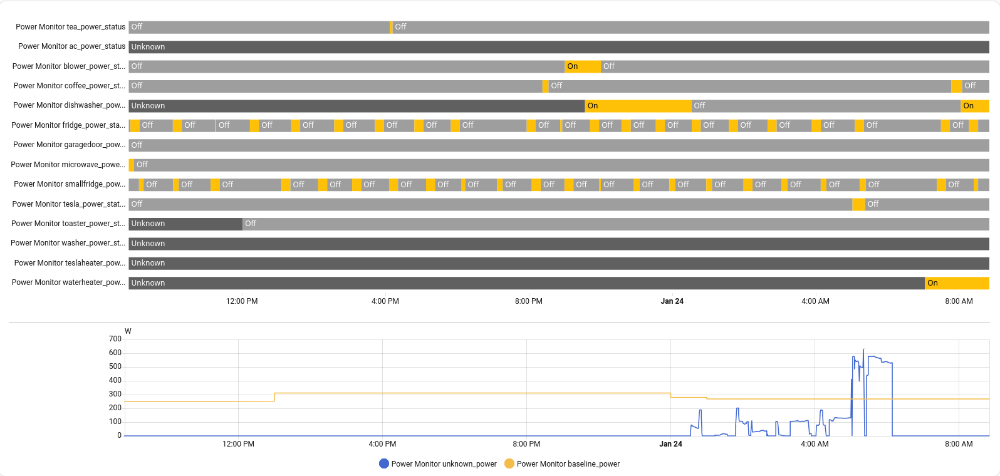
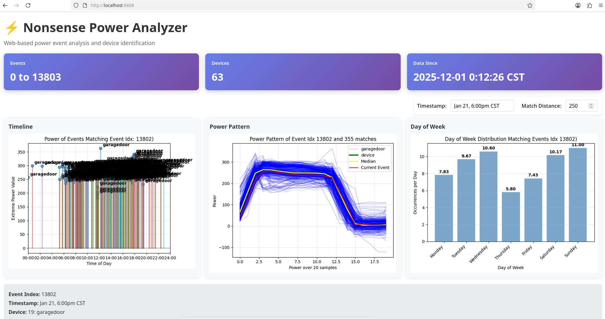
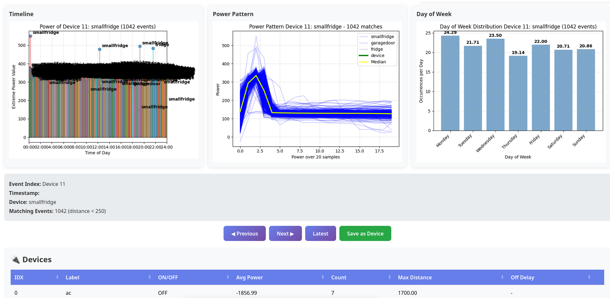

# nonsense-powermonitor

Now that Sense no longer sells the orange powermonitor, and the green powermonitor from Schneider Home doesn't work with Home Assistant, I decided to try my own.

You need to have Home Assistant installed for viewing and logging the results of the powermonitor

As the Home Assistant graph shows, each device ON/OFF state is tracked, the baseline power (always on) is tracked, and the unknown power is tracked.

This app uses a INTERVAL=once-per-second power measurement from my Enphase setup. Other hardware can easily be added in `powerMonitor.py`.
The sense device sends a packet every 2 seconds, but it contains no useful information, and every 2 seconds is too slow.
Would be nice if they could change that (see sense_listener.py)

## Overview

A webpage interface shows the latest event and if it matched to any devices.

It also lets you browse events or devices or jump to an event at a particular date.

## Event detection and MQTT

In the background, the power is monitored, and has to change by TRIGGER = 20 W to trigger an event. I realize that depending on your setup, you might need to increase this threshold, I should make it an environmental variable.
    - TVs and computers use very unpredictable amounts of power and look like noise.
    - LEDs use very little power and often blend in with TVs and computers, so they are difficult to detect.
    - (A possible future feature: add MQTT inputs from smart plugs through Home Assistant.)
- After an event is triggered, EVENT_SIZE = 20 seconds of data are recorded and saved as an event.
- The event is compared to "devices" stored in the database.
- If a match is found, MQTT sends an `ON` message if the average net power during the 20 s > 0, and `OFF` if <= 0.
- An average power message is also sent for the device.
- If the device has a stored off-time, an `OFF` message is queued to be sent later (along with power back to 0).

## Baseline and unknown power

- Baseline power is tracked as the minimum in the last hour and stored for 24 hours.
- Baseline power is sent over MQTT every hour as the minimum power of the last 24 hours.
- Unknown power (power that doesn't match a known device) is sent over MQTT every minute.

## Web interface (Flask)

The web interface allows for analysis of saved events. I recommend you run the code for 24 hours or longer before analyzing.

- The analysis looks for visually similar events and groups them into clusters.
- You can name each cluster as a device. Multiple clusters can share the same device name.
  - For example, my EV charging turning on doesn't always look the same, so I have multiple clusters all named `ev`.
- The off event should also have the same device name.
  - Refrigerators are usually easy to recognize when they turn on but not when they turn off. For those I use an "on" device with a 15-minute off delay so the system sends an off message after 15 minutes.

## Tuning

- Once you have a number of devices, you can tweak the `max distance`.
  - A smaller `max distance` requires events to be more similar, which helps distinguish similar devices (for example, two refrigerators).
  - Many devices look similar (e.g., many are ~1400 W heaters), so tuning is necessary to separate similar loads.
- You can browse past events or jump to a specific timestamp, then adjust `max distance` until you isolate the group of matching events that identify your device, and then save that device group.
- You can also delete devices if needed.

## Notes

- Other hardware sources of power data can be integrated by editing `powerMonitor.py`.
- Running for at least 24 hours gives the analyzer enough events to form clusters and produce meaningful results.

## Installation
- Docker install should be the most straightforward, see README_DOCKER.md
- you can run the python code in your own environment:
  - powerMonitor.py runs in the background monitoring power and saving events and sending MQTT messages
  - poweranalyser.py is a CLI version of the web application
  - nonsense_power_analyzer.py is the Flask web application
  - you can move poweMonitor.service to /etc/systemd/system/ if you were so inclined to run it as a service
    
